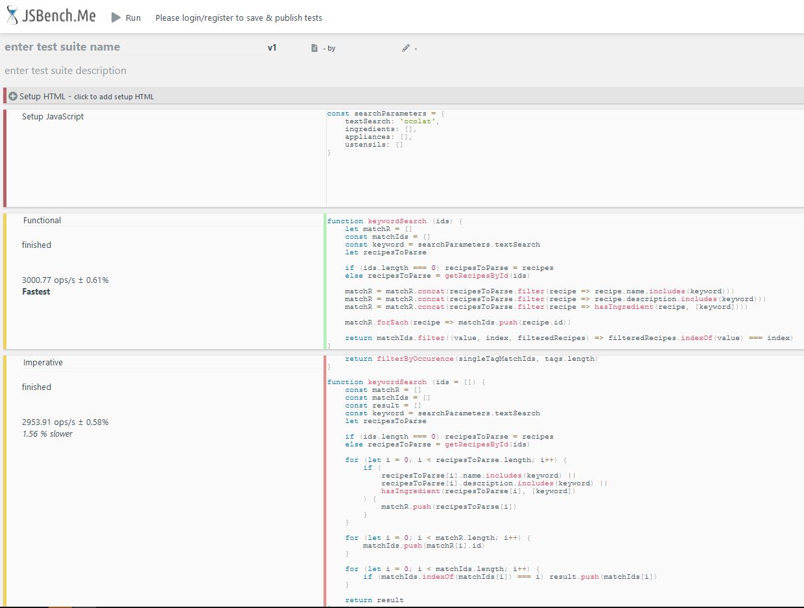
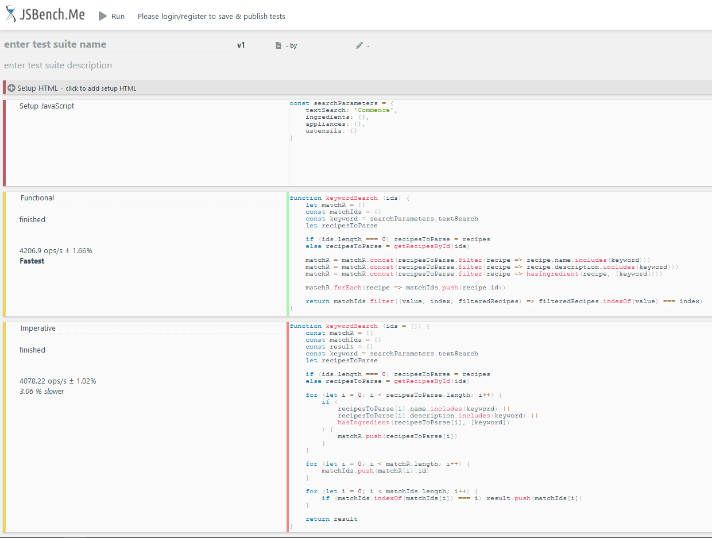
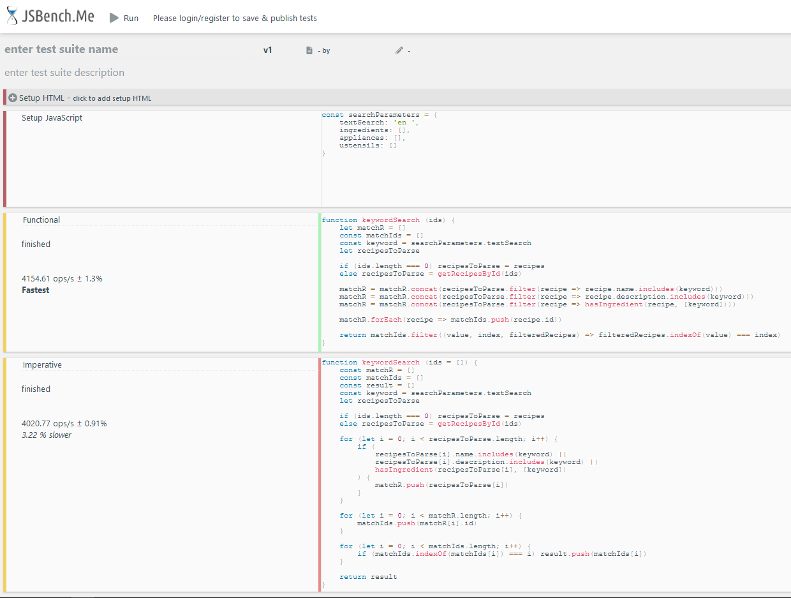

# Les Petits Plats : Fiche d'investigation

Deux algorithmes de recherche ont été implémentés et comparés.

## Index

**1 - Points communs aux deux approches**  
___ 1.1 - Approche commune détaillée

**2 - Programmation fonctionnelle**  
___ 2.1 - Description de l'approche  

**3 - Programmation impérative**  
___ 3.1 - Description de l'approche  

**4 - Comparaison des performances**  
___ 4.1 - Cas 1 : pas de saisie, 1 tag  
___ 4.2 - Cas 2 : 1 mot clé présent dans le titre, les ingrédients, la description  
___ 4.3 - Cas 3 : 1 mot clé présent dans le titre uniquement  
___ 4.4 - Cas 4 : 1 mot clé présent dans la description uniquement  
___ 4.5 - Cas 5 : 1 mot clé présent dans la description uniquement  

**5 - Synthèse / Bilan**  

___

## 1 - Points communs aux deux approches

Ils permettent tous les deux de rechercher des recettes correspondant à un ou plusieurs critères.  

Les critères de recherches sont les suivants :

- Une saisie dans la barre de recherche déclenche une recherche parmi : le nom, les ingrédients et la description de la recette.
- La sélection d'un ou plusieurs tag(s) parmi trois catégories (ingrédients, ustensiles, appareils) déclenche la recherche dans les clés "ingredient", "ustensils" et "appliances" de chaque objet recette.  
- L'algorithme de recherche par tag est identique pour les deux approches, **seule la recherche par saisie dans la barre de recherche diffère entre les deux approches.**

Exemple de recette :

```js
{
        "id": 1,
        "name" : "Limonade de Coco",
        "servings" : 1,
        "ingredients": [
            {
                "ingredient" : "Lait de coco",
                "quantity" : 400,
                "unit" : "ml"
            },
            {
                "ingredient" : "Jus de citron",
                "quantity" : 2
            },
            {
                "ingredient" : "Crème de coco",
                "quantity" : 2,
                "unit" : "cuillères à soupe"
            },
            {
                "ingredient" : "Sucre",
                "quantity" : 30,
                "unit" : "grammes"
            },
            {
                "ingredient": "Glaçons"
            }
        ],
        "time": 10,
        "description": "Mettre les glaçons à votre goût dans le blender, ajouter le lait, la crème de coco, le jus de 2 citrons et le sucre. Mixer jusqu'à avoir la consistence désirée",
        "appliance": "Blender",
        "ustensils": ["cuillère à Soupe", "verres", "presse citron" ]
    }
```

Lien vers [l'algorigramme de recherche](https://whimsical.com/p7-les-petits-plats-logigramme-W6cBsyYcQSZ8L751F5CXtD)

Lien vers le [diagramme des fonctions](https://whimsical.com/p7-les-petits-plats-v1-NyNKLgzuPJdexavg1fegBN).  

### 1.1 - Approche commune détaillée

1. Récupérer les paramètres de recherche dans l'objet ***searchParameters***

```js
export const searchParameters = {
    textSearch: '',
    ingredients: [],
    appliances: [],
    ustensils: []
}
```

2. Fonction ***search()***

La fonction `search()` retourne un ou plusieurs `id` de recette(s) et peut appeller 4 sous-fonctions indépendantes :

```js
ustensilsSearch()
appliancesSearch()
ingredientsSearch()
keywordSearch()

```

Selon le cas de figure :

**Aucun paramètre de recherche :**  
Cas type : chargement de la page  
Retourne un tableau de nombres allant de 1 à 50.  

**1 mot clé saisi dans la barre de recherche** :  
Appel de la fonction `keywordSearch()`  

**1 tag sélectionné dans une liste :**  
Appel de la fonction correspondante (ex: `ingredientsSearch()` pour un tag ingrédient)

**Recherche multi-paramètres :**  
On recherche l'intersection du résultat de plusieurs recherches.

ex :

```js
export const searchParameters = {
    textSearch: 'Smoothie',
    ingredients: [],
    appliances: ['Blender'],
    ustensils: ['verres']
}
```

On itère sur les objets activeSearch et searchResults en parallèle:

```js
const activeSearch = {
        ingredients: searchParameters.ingredients.length > 0,
        appliances: searchParameters.appliances.length > 0,
        ustensils: searchParameters.ustensils.length > 0,
        text: searchParameters.textSearch !== ''
    }

const searchResults = {
            ingredients: () => ingredientsSearch(idsFound),
            appliances: () => appliancesSearch(idsFound),
            ustensils: () => ustensilsSearch(idsFound),
            text: () => keywordSearch(idsFound)
        }
```

1. `activeSearch.ingredients` : `false`
2. Pas de recherche par tag ingrédient
3. `activeSearch.appliances`: `true`
4. On appelle la fonction associée à la clé `searchResult.appliances` : `appliancesSearch(idsFound)`
5. Comme `appliancesSearch(idsFound)` est la première sous-fonction de recherche appelée, elle reçoit `idsFound = []` comme argument.
6. Comme le tableau est vide, elle itère donc sur le tableau complet des recettes.
7. Elle stock les ids des 5 recettes répondant au critère (tag) "Blender" dans `idsFound`
8. `activeSearch.ustensils` : `true`
9. On appelle la fonction associée à la clé `searchResult.ustensils` : `ustensilsSearch(idsFound)`
10. `idsFound = [1, 17, 18, 19, 49]` (on itère uniquement sur les résultats de la première recherche)
11. ELle stock les ids des 5 recettes répondant au critère (tag) "verres" dans `idsFound`
12. `activeSearch.text` : `true`
13. On appelle la fonction associée à la clé `searchResult.text` : `keywordSearch(idsFound)`
14. `idsFound = [1, 17, 18, 19,49]` (résultats filtrés par les 2 premières recherches)
15. ELle stock les ids des 3 recettes répondant au critère (mot clé) "Smoothie" dans `idsFound`
16. `idsFound = [17, 18, 49]`

**Notes**

L'avantage de cet algorithme est qu'il permet de :  

1. Déclencher la recherche seulement en cas de saisie par l'utilisateur
2. Restreindre le scope des recherches au résultats des recherches précédentes uniquement  

Ainsi, même si les 4 sous-fonctions de recherche sont indépendantes, dans le cas d'une recherche d'intersection, la recherche *n+1* se base sur les résultats de la recherche *n*, ce qui évite :

- Que chaque sous-fonction itère systématiquement sur les 50 recettes
- De devoir recroiser les résultats à la fin  
  
Soit, selon l'exemple ci-dessus :  

- Recherche 1 (tag *ingrédient*) : pas de saisie utilisateur, non évalué
- Recherche 2 (tag *appareil*) : première recherche effective, itère sur 50 recettes => renvoie 5 recettes
- Recherche 3 (tag *ustensile*) : itère sur 5 recettes => renvoie 5 recettes
- Recherche 4 (mot clé) : itère sur 5 recettes => renvoie 3 recettes

Par ailleurs, comme la fonction de recherche par mot-clé `keywordSearch()` doit vérifier la correspondance entre une chaîne de caractères dans chacun des 3 champs Titre, Ingrédients, Description, ce qui a priori est plus long que la recherche par "tag", on l'appelle en dernier afin de lui donner un minimum de recettes dans lesquelles chercher.  

Une optimisation possible de l'algorithme serait de permuter de manière dynamique l'ordre d'appel des fonctions de recherches afin de déclencher la plus rapide et/ou la plus restrictive en premier.

## 2 - Programmation fonctionnelle

```js
function keywordSearch (ids) {
    let matchR = []
    const matchIds = []
    const keyword = searchParameters.textSearch
    let recipesToParse

    if (ids.length === 0) recipesToParse = recipes
    else recipesToParse = getRecipesById(ids)

    matchR = matchR.concat(recipesToParse.filter(recipe => recipe.name.includes(keyword)))
    matchR = matchR.concat(recipesToParse.filter(recipe => recipe.description.includes(keyword)))
    matchR = matchR.concat(recipesToParse.filter(recipe => hasIngredient(recipe, [keyword])))

    matchR.forEach(recipe => matchIds.push(recipe.id))

    return matchIds.filter((value, index, filteredRecipes) => filteredRecipes.indexOf(value) === index)
}
```

### 2.1 - Description de l'approche

- Pas d'affectations requises (les variables `matchR` et `matchIds` ont été déclarés et affectées par souci de lisibilité du code mais pouvaient être évitées)
- Transparence référentielle : pas d'effet de bord produit par les fonctions
- Fonctions/méthodes passées en paramètres `concat( filter( include() ) )`

## 3 - Programmation impérative


```js
function keywordSearch (ids = []) {
    const matchR = []
    const matchIds = []
    const result = []
    const keyword = searchParameters.textSearch
    let recipesToParse

    if (ids.length === 0) recipesToParse = recipes
    else recipesToParse = getRecipesById(ids)

    for (let i = 0; i < recipesToParse.length; i++) {
        if (
            recipesToParse[i].name.includes(keyword) ||
            recipesToParse[i].description.includes(keyword) ||
            hasIngredient(recipesToParse[i], [keyword])
        ) {
            matchR.push(recipesToParse[i])
        }
    }

    for (let i = 0; i < matchR.length; i++) {
        matchIds.push(matchR[i].id)
    }

    for (let i = 0; i < matchIds.length; i++) {
        if (matchIds.indexOf(matchIds[i]) === i) result.push(matchIds[i])
    }

    return result
}
```

### 3.1 - Description de l'approche

Séquence d'instructions composée :

- d'une boucle `for`
- de structures conditionnelles `if`
- d'affectations des variables `matchR`, `matchIds`, `result`


## 4 - Comparaison des performances

### 4.1 - Cas 1 : pas de saisie, 1 tag

Les 2 algorithmes étant identiques pour la recherche par tag, ils ne présentent pas de différence de performances lorsque l'on recherche seulement un tag.


*Graphique cas 1*

___

### 4.2 - Cas 2 : 1 mot clé présent dans le titre, les ingrédients, la description
Lorsqu'on saisit un mot clé "ocolat", qui renvoie des résultats basés depuis tous les champs à parcourir, la version fonctionnelle est plus performante.



*Graphique cas 2*

___

### 4.3 - Cas 3 : 1 mot clé présent dans le titre uniquement
Lorsqu'on saisit un mot clé "Tart", qui ne renvoie des résultats que sur le titre des recettes, la version fonctionnelle est plus performante.


*Graphique cas 3*

___

### 4.4 - Cas 4 : 1 mot clé présent dans la description uniquement
Lorsqu'on saisit un mot clé "Commence" présent dans la description uniquement, la version fonctionnelle est plus performante.


*Graphique cas 4*

___

### 4.5 - Cas 5 : 1 mot clé présent dans la description uniquement
Lorsqu'on saisit un mot clé "en " (suivi d'un espace) présent dans la description uniquement, la version fonctionnelle est plus performante.


*Graphique cas 5*

___

## 5 - Synthèse / Bilan

|Paradigme|Fonctionnel|Impératif|
|-|--|--|
|Cas 1 tag |Identique| Identique|
|Cas 2 "ocolat"|Plus rapide|1.56% plus lent|
|Cas 3 "Tart"|Plus rapide|2.73% plus lent|
|Cas 4 "Commence"|Plus rapide| 3.06% plus lent|
|Cas 5 "en "|Plus rapide|3.22% plus lent|

Bien que l'échantillon de 50 recettes soit assez réduit pour comparer de manière fiable les différences de performances entre les deux algorithmes, **l'approche fonctionnelle semble plus efficace que l'approche impérative**.  

Sur les cas 2 à 5, l'approche fonctionnelle s'est avérée plus rapide (approche impérative plus lente de 2.64% en moyenne)

Outre l'aspect des performances, l'approche fonctionnelle a l'avantage d'être plus lisible.